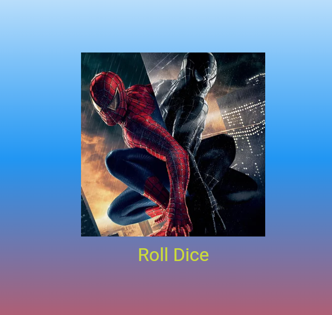

# Лабораторная работа №3. Flutter: структура UI и компонентный подход

**Фамилия Имя:** Катаржин Гриша  

**Группа:** ИСП-232

**Дата сдачи:** 20.04.2026

## Что изучили

1. Создание кастомных виджетов путем наследования от `StatelessWidget` и `StatefulWidget`.
2. Разбиение интерфейса на отдельные файлы для улучшения читаемости и переиспользования кода.
3. Передача данных между виджетами через параметры конструктора.
4. Управление состоянием приложения с помощью `setState` для динамического обновления UI.
5. Работа с ресурсами (assets) и добавление изображений в проект.

## Скриншот финального приложения



## Ссылка на репозиторий

[Ссылка на ваш GitHub репозиторий](https://github.com/Gabrovez/Flutter_Lab3)

## Инструкция по запуску

1. Клонируйте репозиторий:
   ```bash
   git clone https://github.com/Gabrovez/Flutter_Lab3
   ```
2. Перейдите в папку проекта:
   ```bash
   cd flutter_lab3_app
   ```
3. Установите зависимости:
   ```bash
   flutter pub get
   ```
4. Запустите приложение:
   ```bash
   flutter run -d chrome
   ```

## Ответы на вопросы

**1. Зачем выносить виджеты в отдельные файлы? Что изменится если держать всё в main.dart?**  
Вынос виджетов в отдельные файлы делает код модульным, облегчает навигацию по проекту и позволяет переиспользовать компоненты в разных частях приложения. Если держать всё в `main.dart`, файл быстро станет огромным, сложным для чтения и поддержки, что нарушает принцип единственной ответственности.

**2. Что такое BuildContext? Почему метод build() принимает его как параметр?**  
`BuildContext` — это объект, который содержит информацию о положении виджета в дереве элементов. Он необходим для доступа к родительским виджетам, темам, локализации и другим данным, зависящим от местоположения виджета в иерархии. Метод `build()` принимает его, чтобы виджет мог корректно отрисовываться с учетом текущего контекста приложения.

**3. Чем StatelessWidget отличается от StatefulWidget? Приведите пример когда нужен каждый из них.**  
`StatelessWidget` используется для статичного интерфейса, который не меняется после создания (например, текстовая метка или иконка). `StatefulWidget` используется для динамического интерфейса, который может изменяться в ответ на действия пользователя или другие события (например, счетчик кликов или анимация). Пример для `StatelessWidget`: заголовок страницы. Пример для `StatefulWidget`: форма ввода данных или игра в кости.

**4. Почему Random() создаётся на уровне файла, а не внутри rollDice()?**  
Создание объекта `Random()` на уровне файла позволяет использовать один и тот же экземпляр генератора случайных чисел при каждом вызове метода. Если создавать `Random()` внутри `rollDice()`, то при частых вызовах может генерироваться одно и то же число из-за использования текущего времени как зерна (seed), что снижает качество случайности. Глобальный экземпляр эффективнее и обеспечивает более равномерное распределение значений.
